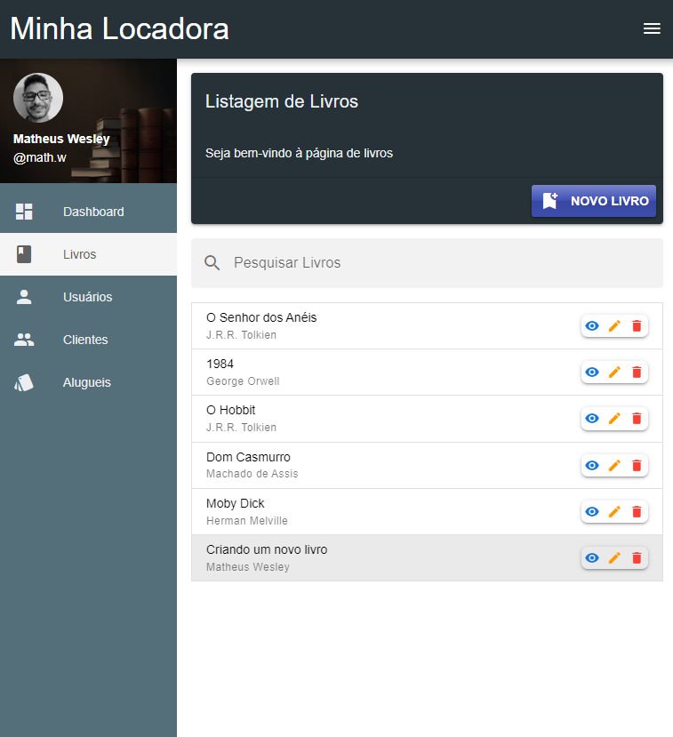
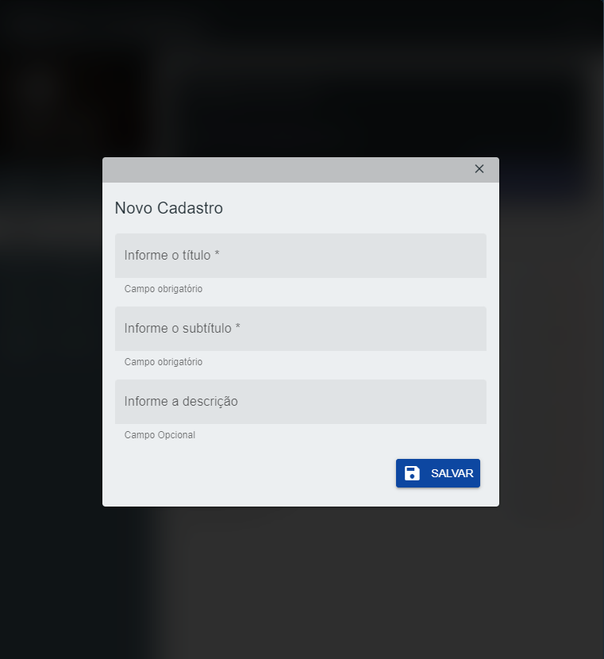
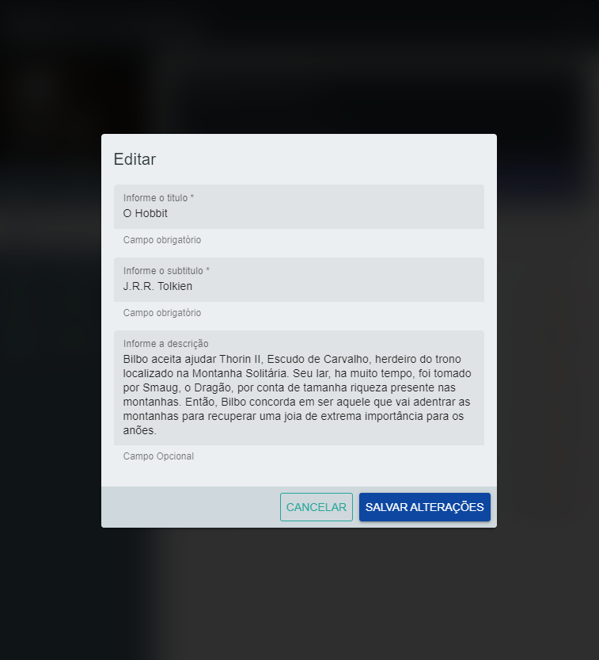
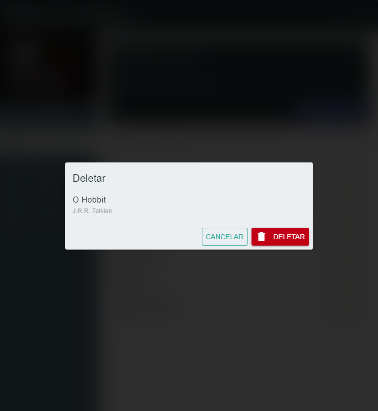
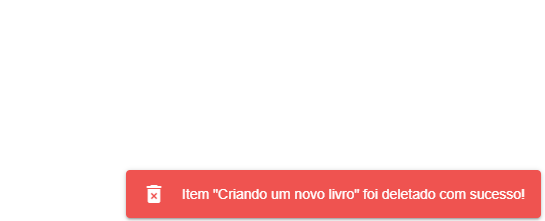

# locadora-quasar

É um projeto bem básico construído em cima de Vue com o framework Quasar, que tem o objetivo inicial de melhorar meus conhecimentos nessas ferramentas.

## Imagens do projeto

### Telas Principais

#### Notificações

OBS: Sei que ainda faltam muitos polimentos neste projeto e estou trabalhando nisso. Como ja informei quero utilizar esse projeto como uma forma de aprimorar meus conhecimentos e testar algumas ideias.

## CheckList
Aqui vou colocar o que preciso fazer e o que ja está feito.

O que preciso fazer
- [ ] Pagina de Dashboard 
- [x] Pagina de Livros
- [x] Pagina de Usuários
- [x] Pagina de Clientes
- [x] Pagina de Alugueis  

- [x] Viewers que ja implementei o LocalStorage
  - [ ] Pagina de Dashboard 
  - [x] Pagina de Livros
  - [ ] Pagina de Usuários
  - [ ] Pagina de Clientes
  - [ ] Pagina de Alugueis 